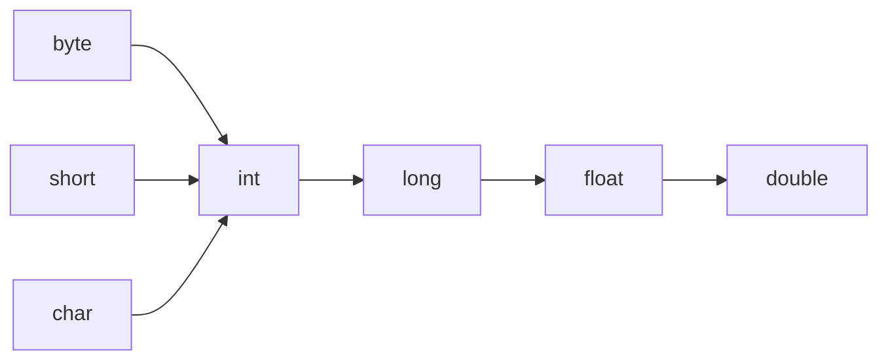

# 关键字

定义：被Java语言赋予了特殊含义，用作专门用途的字符串，比如说public、void等。

特点：全部关键字都是小写字母。

tips：关键字比较多，不需要死记硬背，学到哪里记到哪里即可。

官方地址：https://docs.oracle.com/javase/tutorial/java/nutsandbolts/_keywords.html

特殊的：const和goto，它们是保留字。

# 识别符

定义：Java中变量、方法、类等要素命名时使用的字符序列，称为标识符。

技巧：凡是自己可以起名字的地方都叫标识符。

命名规则：

1. **组成**：字母（A-Z/a-z）、数字（0-9）、下划线（`_`）、美元符号（`$`）
2. **首字符**：不能是数字（必须以字母、`_`或`$`开头）
3. **区分大小写**：`myVar` 和 `myvar` 不同
4. **禁用关键字**：不能使用`public`、`class`等保留字
5. **无空格**：标识符中不允许出现空格

命名规范：

> 行业规范

1. **类名/接口名**：
   1. **大驼峰式（UpperCamelCase）**：首字母大写，后续单词首字母大写。
   2. 示例：`String`, `ArrayList`, `StudentRecord`。
2. **方法名/变量名**：
   1. **小驼峰式（lowerCamelCase）**：首字母小写，后续单词首字母大写。
   2. 示例：`getName()`, `calculateTotal()`, `studentAge`。
3. **常量名**：
   1. **全大写 + 下划线分隔**：用于`static final`常量。
   2. 示例：`MAX_SIZE`, `PI`, `DEFAULT_TIMEOUT`。
4. **包名**：
   1. **全小写 + 点分隔**，通常使用域名反写。
   2. 示例：`com.example.project`, `org.apache.commons`。
5. **避免使用`$`和`_`开头**：
   1. 虽然合法（如`_name`），但可能被编译器内部使用，易混淆。

示例：

```java
// 定义类（标识符：HelloWorld）
public class HelloWorld {

    // 定义方法（标识符：main）
    public static void main(String[] args) {
        
        // 定义变量（标识符：greeting）
        String greeting = "Hello, World!";
        
        // 调用方法（标识符：System/out/println）
        System.out.println(greeting);
    }
}
```

# 变量

## 变量的类型

在Java中，变量类型可分为两大类：**基本数据类型（Primitive Types）**和**引用数据类型（Reference Types）**。

具体分类如下：

1. **基本数据类型（8种）**
   - **整型（4种）**：
     - `byte`：8位有符号整数（范围：-128 到 127）
     - `short`：16位有符号整数（范围：-32,768 到 32,767）
     - `int`：32位有符号整数（范围：-2³¹ 到 2³¹-1），这个比较常用
     - `long`：64位有符号整数（范围：-2⁶³ 到 2⁶³-1），字面量赋值需要后缀`L`或者`l`（推荐大写）。字面量超过了int类型，必须加上后缀，如果没有超过int类型，可以省略，但是建议保留。


   - **浮点型（2种）**：
     - `float`：32位**单精度**浮点数（需后缀 `f`，如 `3.14f`），尾数可以精确到7位有效数字。声明float时需要提供后缀，后缀是`f`或者`F`。
     - `double`：64位**双精度**浮点数（默认浮点类型），精度是单精度浮点类型的两倍。一般情况下，都会定义double类型，因为精度更高。
     - 说明：
       1. 并不是所有的小数都能精确的用二进制浮点数表示，二进制浮点数不能精确表示0.1、0.01、0.001这样10的负次幂。
       2. 浮点类型float、double的数据不适合在 **不容许舍入误差** 的金融计算领域。如果需要精确数字计算或者保留指定位数的精度，需要使用**BigDecimal**类。

   - **字符型（1种）**：
     - `char`：16位（2字节）Unicode字符（如 `'A'`），总之范围很广，但不能用来表示表情符号

   - **布尔型（1种）**：
     - `boolean`：表示逻辑值（仅 `true` 或 `false`）

2. **引用数据类型（无限种）**
   - **类（Class）**：如 `String`、自定义类（如 `Person`）。
   - **接口（Interface）**：如 `List`、`Runnable`。
   - **数组（Array）**：如 `int[]`、`String[][]`。
   - **枚举（Enum）**：一种特殊的类（Java 5+支持）。
   - **注解（Annotation）**：一种特殊的接口（Java 5+支持）。

> **总结**：  
> - **基本数据类型固定为8种**（数值型6种 + `char` + `boolean`）。  
> - **引用数据类型数量无限**（由开发者定义或Java内置，如类、接口等）。  
>
> 变量的格式： `数据类型 变量名 = 变量值`
>
> **示例代码**：
> ```java
> // 基本数据类型
> int age = 30;
> double price = 19.99;
> char grade = 'A';
> boolean isJavaFun = true;
> 
> // 引用数据类型
> String name = "Alice";          // 类
> int[] numbers = {1, 2, 3};      // 数组
> List<String> list;              // 接口
> ```

## 字符型（char）

### 表现形式

在 Java 中，`char` 类型变量（16 位无符号整数）有以下多种表现形式，这些形式都对应 Unicode 字符：

1. **直接字符字面量**

```java
char c1 = 'A';     // 英文字母
char c2 = '中';    // 中文字符
char c3 = '❤';     // 特殊符号
char c4 = 'あ';    // 日文字符
```

2. **Unicode 转义序列（\\uXXXX）**

```java
char u1 = '\u0041';    // 'A' (U+0041)
char u2 = '\u4e2d';    // '中' (U+4E2D)
char u3 = '\u2764';    // '❤' (U+2764)
char u4 = '\u3042';    // 'あ' (U+3042)
```

3. **整数赋值（十进制/十六进制）**

```java
char d1 = 65;        // 十进制 → 'A'
char h1 = 0x0041;    // 十六进制 → 'A'
char d2 = 20013;     // 十进制 → '中' (20013=0x4E2D)
```

4. **特殊转义字符**

```java
char esc1 = '\n';    // 换行符 (U+000A)
char esc2 = '\t';    // 制表符 (U+0009)
char esc3 = '\\';    // 反斜杠 (U+005C)
char esc4 = '\'';    // 单引号 (U+0027)
```

5. **代理对（Surrogate Pair）表示**

> 用于超出 BMP 的 Unicode 字符（需两个 `char` 组合）
```java
// 😊 (U+1F60A)
char highSurrogate = '\uD83D';  // 高代理项
char lowSurrogate = '\uDE0A';   // 低代理项
String emoji = highSurrogate + "" + lowSurrogate;  // "😊"

// 直接使用字符串
String rocket = "\uD83D\uDE80"; // "🚀" (U+1F680)
```

6. **类型转换**

```java
// int 转 char
int codePoint = 0x4E2D;      // "中" 的码点
char c = (char) codePoint;   // '中'

// char 转 int
int num = 'A';               // 65
```

7. **Character 类方法**

```java
char c = Character.toChars(0x1F60A)[0]; 
// 注意：超出 BMP 的字符会返回 char 数组（需两个元素）

// 码点直接转字符串
String s = Character.toString(128512); // "😀" (U+1F600)
```

关键特性说明：

| **表现形式** | **示例**         | **适用场景**            |
| ------------ | ---------------- | ----------------------- |
| 直接字符     | `'中'`           | 直观表示常见字符        |
| Unicode 转义 | `'\u4e2d'`       | 键盘无法直接输入的字符  |
| 整数赋值     | `char c = 65;`   | 程序生成字符            |
| 特殊转义序列 | `'\n'`           | 控制字符（换行/制表等） |
| 代理对       | `"\uD83D\uDE00"` | 表情符号/罕见字符       |
| 类型转换     | `(char) 0x4E2D`  | 码点与字符转换          |

注意事项：

1. **代理对限制**  
   单个 `char` **不能完整表示**超出基本多语言平面（BMP）的字符（如大部分表情符号），必须使用两个 `char` 或直接操作字符串：
   ```java
   // 错误示例（字符被截断）
   char broken = '😊';  // 编译错误：字符字面量过大
   
   // 正确做法
   String emoji = "😊"; 
   ```

2. **码点直接操作**  
   对于全 Unicode 支持（包括辅助平面），推荐使用码点 API：
   ```java
   String text = "Hello😊";
   int codePoint = text.codePointAt(5);  // 获取 😊 的完整码点 (128522)
   int charCount = text.codePointCount(0, text.length()); // 实际字符数 (6)
   ```

3. **字符与整数互操作性**  
   `char` 可直接参与整数运算：
   ```java
   char c = 'A';
   c++;  // 结果 'B' (66)
   ```

示例代码：混合演示

```java
public class CharDemo {
    public static void main(String[] args) {
        // 多种赋值方式
        char euro = '€';      // 直接字符
        char omega = '\u03A9'; // Unicode 转义
        char heart = 0x2764;  // 十六进制整数
        
        System.out.println(euro);   // €
        System.out.println(omega);  // Ω
        System.out.println(heart);  // ❤

        // 代理对处理表情符号
        String smiley = new String(new char[]{'\uD83D', '\uDE0A'});
        System.out.println(smiley); // 😊

        // 码点操作
        int codePoint = Character.codePointAt(smiley, 0);
        System.out.println("😊 的码点: U+" + Integer.toHexString(codePoint)); // U+1f60a
    }
}
```

> **最佳实践**：当处理国际化文本（尤其是包含表情符号或罕见字符）时，优先使用 `String` 类和 `Character` 的码点方法（如 `codePointAt()`、`codePointCount()`），而非直接操作 `char` 数组。

### 我的疑虑

#### 什么场景下会用到char类型？

1. **你要处理的对象本质就是一个“字符”**：一个字母、一个数字字符、一个符号、一个空格、一个换行符等等。用 `char` 最能清晰表达你的意图。
2. **你需要操作字符串中的单个字符**：遍历字符串、修改特定字符、检查字符属性等。`String` 类底层和 `toCharArray()` 方法都离不开 `char`。
3. **你需要表示键盘按键、游戏角色方向等符号化的东西**：比如用 `'W'`, `'A'`, `'S'`, `'D'` 表示上下左右移动。
4. **你在处理底层文本数据流**：读写文件、网络传输中处理原始字符时。
5. **你需要利用字符编码值做一些简单转换或计算**：并且明确知道自己在做什么。

简单总结就是，**当你脑子里想的是“一个字母”、“一个符号”、“键盘上的一个键”时，就应该考虑用 `char`。** 当你想的是“多少钱”、“多少岁”、“第几个”这种纯粹的数字时，就用 `int` (或其他数字类型)。

## 基本数据类型变量间的自动类型提升规则

### **核心规则** 

1. **所有`byte`、`short`、`char`在运算时自动提升为`int`**  
   即使没有其他类型参与，这三个类型在表达式中也会被提升为`int`：
   
   ```java
   byte a = 10;
   short b = 20;
   char c = 'A'; // 'A'的ASCII值为65
   int result = a + b + c; // 自动提升为int
   ```
   
2. **若表达式中有`long`，则整体提升为`long`**  
   
   ```java
   int x = 100;
   long y = 200L;
   long result = x + y; // x自动提升为long
   ```
   
3. **若表达式中有`float`，则整体提升为`float`**  
   ```java
   long a = 1000L;
   float b = 3.14f;
   float result = a + b; // a自动提升为float
   ```

4. **若表达式中有`double`，则整体提升为`double`**（最高优先级）  
   ```java
   float a = 10.5f;
   double b = 20.8;
   double result = a + b; // a自动提升为double
   ```

---

### **类型提升顺序（由低到高）**


> 💡 **注意**：`long`到`float`、`float`到`double`的转换可能导致精度损失（如`long`范围大但`float`的尾数精度有限）。

---

### **关键细节**
1. **赋值时需显式强制转换**  
   自动提升仅在表达式中发生。若结果赋给较小类型，需手动强制转换：
   ```java
   byte a = 10;
   byte b = 20;
   byte c = (byte) (a + b); // 必须强制转换，否则编译错误（结果已提升为int）
   ```

2. **复合赋值运算符（如`+=`）隐含强制转换**  
   ```java
   byte a = 10;
   a += 20; // 等价于 a = (byte) (a + 20);
   ```

3. **常量优化机制**  
   若表达式右侧是常量，且值在目标类型范围内，编译器自动优化：
   ```java
   byte a = 10 + 20; // 合法，30在byte范围内（-128~127）
   ```

---

### **示例解析**
```java
byte b = 42;
char c = 'a'; // ASCII=97
short s = 1024;
int i = 50000;
float f = 5.67f;
double d = 0.1234;

double result = (f * b) + (i / c) - (d * s);
```
1. `f * b` → `float` × `byte` → `float`  
2. `i / c` → `int` / `char` → `int`  
3. `d * s` → `double` × `short` → `double`  
4. `(float) + (int)` → `float` + `int` → `float`  
5. `(float) - (double)` → `float` - `double` → `double`（最终结果）

---

### **总结**
- 提升方向：`byte`/`short`/`char` → `int` → `long` → `float` → `double`  
- 目的：避免计算溢出或精度丢失  
- 赋值注意：结果需匹配目标类型，否则需强制转换  
- 特殊场景：常量优化机制可绕过部分规则  

理解自动类型提升能有效避免编译错误和逻辑错误（如意外精度损失）。

