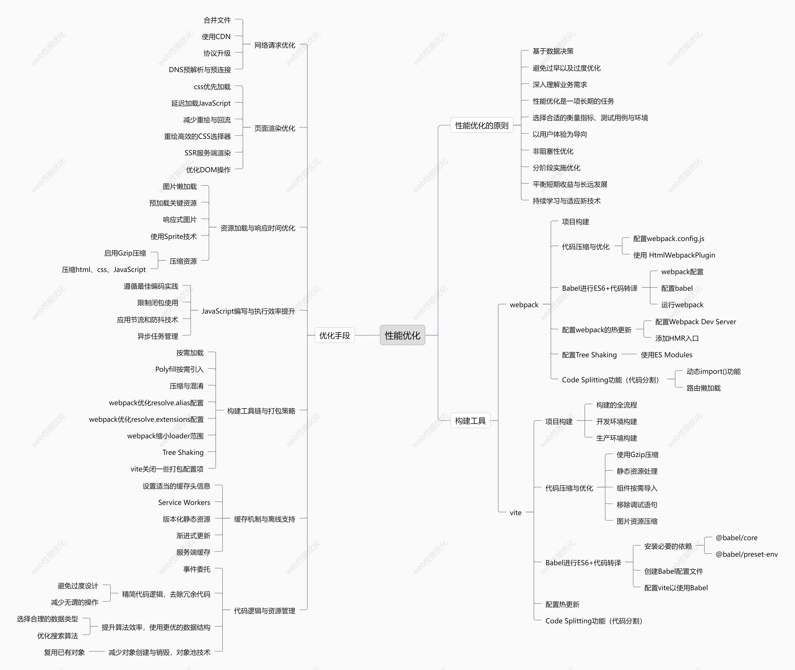

# 性能优化的框架



web性能优化的原则：

1. 基于数据决策：性能优化的第一原则是依据数据，而非凭空猜测。这意味着当怀疑存在性能问题时，应当通过测试、日志记录、性能分析工具（profiling）等手段来确定瓶颈所在，确保优化措施有的放矢。
2. 避免过早以及过度优化：在开发过程中，不应过早地投入过多精力于性能优化，而应在功能稳定后根据实际需要进行针对性优化。此外，优化应适度，追求合理的性价比，避免因过度优化而牺牲代码的可读性和维护性。
3. 深度理解业务需求：代码服务于业务逻辑，因此了解业务流程对于识别潜在的性能问题至关重要。这不仅有助于发现系统设计中的不足之处，还能帮助找到不影响用户体验前提下的优化机会。
4. 性能优化是一项长期的任务：一旦产品上线，就需持续监测其性能表现，并及时响应可能出现的新挑战。建立自动化的检测机制，保持稳定的测试环境，以便能够迅速定位并解决问题，而不是等待用户反馈。
5. 选择合适的衡量指标、测试用例与环境：固定的衡量标准、典型的使用场景以及一致的测试条件是客观反映性能状况的基础。明确核心性能诉求，同时兼顾其他相关指标，可以更全面地评估系统的整体性能。
6. 以用户体验为导向：最终目标是为用户提供更好的体验，因此优化工作不仅要关注技术层面的实际速度（如加载时间），还要考虑用户的感知速度（如视觉呈现的速度）。这意味着即使某些改进对客观测量的影响不大，只要能改善用户的感觉，也是值得做的。
7. 非阻塞性优化：确保优化活动不会阻碍正常的开发进度或引入新的复杂性。例如，在大型团队中，“把CSS放在头部”和“把JS放在尾部”的传统做法可能会导致协作困难，因此需要寻找既能遵循最佳实践又能促进高效开发的方式。
8. 分阶段实施优化：从需求分析到架构设计再到具体编码，每个阶段都有可能涉及到性能考量。越早介入往往可以获得更好的效果，但也要注意不要让优化成为阻碍项目前进的因素。
9. 平衡短期收益与长远发展：有时候为了快速见效，可能会采取一些短期内有效的措施，但从长远来看这些措施可能会带来额外的成本或限制未来的灵活性。因此，在做决策时要综合考虑短期与长期的影响。
10. 持续学习与适应技术：Web技术和浏览器特性不断演进，新的优化策略也随之出现。保持对最新趋势和技术的关注，适时更新自己的知识体系，可以使我们的优化方案始终保持先进性。

# 优化手段

## 网络请求优化

1. **合并文件**：通过减少HTTP请求数量来加速页面加载，可以将多个CSS或JavaScript文件合并成一个文件，和使用雪碧图的方式实现。

2. **使用CDN**：利用内容分发网络（CDN）提高资源加载速度，确保用户从最近的服务器获取静态资源。

3. **协议升级**：采用HTTP/2或HTTP/3协议，它们支持多路复用和头部压缩等功能，显著提升资源传输效率。

4. **DNS预解析与预连接**：提前解析域名并建立TCP连接，缩短实际请求时的准备时间。

## 页面渲染优化

1. **css优先加载**：将CSS样式表放置在文档头部，使浏览器能够尽早开始构建渲染树。
2. **延迟加载JavaScript**：把JS脚本放在页面底部，并使用async或defer属性确保它们不会阻碍页面的主要内容显示。

3. **减少重绘与回流**：避免频繁修改DOM结构，尽量批量处理更新动作；对于必须改变布局的操作，尝试先移除元素再做改动，最后重新插入。

4. **重绘高效的css选择器**：选择简洁且特异性较低的选择器，以加快样式匹配的速度。
5. **SSR服务端渲染**：它指的是渲染过程在服务端完成，最终的渲染结果 HTML 页面通过 HTTP 协议发送给客户端，又叫“同构“。SSR主要带来的好处就是 改善SEO表现 和首屏加载速度大大提高。SSR可以通过各种框架和技术实现，比如**React + Next.js**、**Vue + Nuxt.js**。
6. **优化DOM操作（最小化DOM操作）**：减少DOM操作次数和复杂度，因为DOM操作是比较耗时的。

## 资源加载与响应时间优化

1. **图片懒加载**：仅当图像进入视口时才开始加载，减少初始页面加载时不必要的资源请求。

2. **预加载关键资源**：使用`<link rel="preload">`标签告知浏览器哪些资源是最优先级最高的，以便尽早开始下载。

3. **响应式图片**：根据不同设备屏幕尺寸提供适当分辨率的图片，既保证质量又不影响加载速度。

4. **使用Sprite技术**：将小图标合并到一张大图中，通过CSS背景定位来显示不同的图标，从而减少请求次数。
5. **压缩资源：**
   1. **启用Gzip压缩**：服务器端启用Gzip压缩，对文件压缩能大大提高首屏加载速度，对于纯文本文件我们可以至少压缩到原大小的40%，图片不要开启gzip压缩，因为压缩效果不明显。
   2. **压缩HTML、css、JavaScript**：移除不必要的空格、换行符和注释，减小文件大小。

## JavaScript编写与执行效率提升

1. **遵循最佳编码实践**：如避免全局变量、减少函数内部深度嵌套判断逻辑等，以提高代码可读性和维护性。

2. **限制闭包使用**：因为闭包可能会导致内存泄漏并且执行速度较慢，所以在必要时才创建闭包。

3. **应用节流和防抖技术**：用于控制事件处理器的调用频率，特别是在处理滚动、调整大小等高频事件时。

4. **异步任务管理**：利用Promises、async/await语法糖以及Web Workers实现非阻塞式的后台计算，保持界面流畅。

## 构建工具链与打包策略

1. **按需加载**：根据路由或模块分割代码，只加载当前所需的代码段，而非整个应用程序。

2. **Polyfill按需引入**：只为需要兼容性的环境添加polyfill，而不是为所有用户提供相同的polyfill集合。

3. **压缩与混淆**：通过UglifyJS、Terser等工具对JavaScript代码进行压缩和混淆，减小文件大小并保护源码。

4. **webpack优化resolve.alias配置（vite同理）**：`resolve.alias` 配置通过别名来将原导入路径映射成一个新的导入路径。 可以起到两个作用：1.起别名；2.减少查找过程。例如：

```javascript
resolve: {
    alias: {
      'vue$': 'vue/dist/vue.esm.js',
      '@': resolve('src'),
    }
  }
```

5. **webpack优化resolve.extensions配置（vite同理）:**`resolve.extensions` 代表后缀尝试列表，它也会影响构建的性能，默认是：`extensions: ['.js', '.json']`。

后缀尝试列表要尽可能的小，不要把项目中不可能存在的情况写到后缀尝试列表中，频率出现最高的文件后缀要优先放在最前面，以做到尽快的退出寻找过程。

```javascript
resolve: {
    extensions: ['.js', '.vue', '.json'],
}
```

6. **webpack缩小loader范围**

loader是很消耗性能的一个点，我们在配置loader的时候，可以使用include和except来缩小loader执行范围，从而优化性能。 例如：

```javascript
{
    test: /\.svg$/,
    loader: 'svg-sprite-loader',
    include: [resolve('src/icons')]
 }
```

7. **Tree Shaking：**去除未引用的代码，减少最终打包文件的大小。它依赖于ES中的模块语法得以实现。`tree shaking`可以大大减少包体积，是性能优化中的重要一环。 在 vite 和 webpack4.x 中都已经默认开启tree-shaking。
8. **vite关闭一些打包配置项**

```javascript
build: { 
      terserOptions: {
        compress: {
          //生产环境时移除console
          drop_console: true,
          drop_debugger: true,
        },
      },
      //关闭文件计算
      reportCompressedSize: false,
      //关闭生成map文件 可以达到缩小打包体积
      sourcemap: false, // 这个生产环境一定要关闭，不然打包的产物会很大
}
```

## 缓存机制与离线支持

1. **设置适当的缓存头信息**：如Expires或Cache-Control，使得浏览器能够在一定时间内直接使用本地缓存而不必再次发起请求。

2. **Service Workers**：不仅可用于缓存资源，还能实现PWA（Progressive Web Apps）特性，即使在网络不可用的情况下也能正常工作。

3. **版本化静态资源**：通过更改文件名或查询字符串的方式，确保新版本的资源能及时被客户端浏览器加载。

4. **渐进式更新**：当有大量静态资源需要更新时，采取逐步替换的方法，避免一次性更新造成服务器负载骤增。
5. **服务端缓存**：对于动态生成的内容，利用服务端缓存机制减少不必要的数据库查询。

## 代码逻辑与资源管理

1. **事件委托**：事件委托则是通过利用事件冒泡机制，在父级或祖先元素上设置单一的事件监听器来替代多个子元素上的监听器，以此减少事件处理器的数量。
2. 精简代码逻辑，**去除冗余代码**
   1. **避免过度设计**：在编写代码时，应该尽量避免引入不必要的复杂性或功能。例如，过多的条件判断、循环嵌套以及重复执行相同的逻辑都会增加程序的负担。应当定期审查代码，去除那些不再需要的功能模块或者已经过时的设计。
   2. **减少无谓的操作**：对于一些可以在编译期确定结果的操作，不应该放在运行时期处理；同时也要注意防止在同一个地方多次执行相同的工作，比如连续调用相同的函数而没有变化输入参数的情况下。
3. 提升算法效率，**使用更优的数据结构**
   1. **选择合适的数据类型**：不同的数据结构有不同的访问模式和时间复杂度。根据具体应用场景选取最恰当的数据结构可以显著改善性能。例如，在频繁查找元素的情况下，哈希表（Hash Table）比数组更适合；而在保持有序列表时，则可能更适合使用链表或平衡树等。
   2. **优化搜索算法**：如果应用程序中涉及到大量的搜索操作，考虑采用二分查找、二叉搜索树（BST）、红黑树（Red-Black Tree）、B+树等高级算法代替线性扫描。
4. 减少对象创建与销毁，**对象池技术**
   1. **复用已有对象**：频繁地创建和销毁对象会导致垃圾回收器频繁工作，从而拖慢系统速度。可以通过对象池的方式预先分配一批对象实例，并在需要时从池中取出，用完后再放回池中供下次使用。这种方式特别适用于短期存在的小对象，如网络请求中的HTTP连接。

# webpack相关

## 项目构建

### 第一步，安装 Node.js 和 npm

确保开发环境存在node.js和npm

###  第二步，创建一个新的项目文件夹

> 在你的计算机上创建一个新的文件夹作为项目的根目录，并打开命令行工具（如终端或命令提示符）。

```shell
mkdir my-webpack-project
cd my-webpack-project
```

### 第三步，初始化项目

> 在新创建的项目文件夹中初始化一个新的 npm 项目。

```shell
npm init -y
```

### 第四步，安装webpack

> 接下来，你需要安装 Webpack 及其 CLI 工具。

```shell
npm install webpack webpack-cli --save-dev
```

### 第五步，配置 Webpack

> 在项目根目录下创建一个名为 `webpack.config.js` 的文件。这个文件是用来配置 Webpack 如何处理你的模块和其他设置。

这是一个基本的配置文件示例：

```javascript
// webpack.config.js
module.exports = {
  entry: './src/index.js', // 指定入口文件
  output: {
    filename: 'main.js', // 输出文件名
    path: path.resolve(__dirname, 'dist') // 输出路径
  }
```

这里我们指定了项目的入口文件 (`entry`) 和输出文件的位置 (`output`)。

### 第六步，添加构建脚本

> 编辑 package.json 文件，添加一个脚本来运行 Webpack。

```javascript
"scripts": {
  "build": "webpack"
}
```

现在你可以通过运行 `npm run build` 来构建你的项目。

### 第七步，创建源文件

> 在 src 目录下创建你的 JavaScript 源文件，例如 index.js。

```javascript
// src/index.js
console.log('Hello, Webpack!');
```

### 第八步，构建项目

运行以下命令来构建项目：

> 一般是这个命令

```shell
npm run build
```

构建完成后，你会在 `dist` 文件夹下看到生成的 `main.js` 文件。

### 第九步，测试构建结果

创建一个简单的 HTML 文件来加载生成的 `main.js` 文件，并查看控制台输出。

```javascript
<!-- index.html -->
<!DOCTYPE html>
<html lang="en">
<head>
  <meta charset="UTF-8">
  <title>Webpack Test</title>
</head>
<body>
  <script src="dist/main.js"></script>
</body>
</html>
```

将这个 HTML 文件放在 `dist` 目录下，并用浏览器打开它。检查浏览器的开发者工具中的控制台，你应该能看到 "Hello, Webpack!" 的输出。

## 代码压缩与优化

准备工作：

> 安装必要的插件

首先需要安装一些用于压缩和优化的插件。常用的有 `terser-webpack-plugin` 和 `css-minimizer-webpack-plugin`。

安装插件：

```shell
npm install --save-dev terser-webpack-plugin css-minimizer-webpack-plugin
```

### 配置webpack.config.js

接下来，在你的 `webpack.config.js` 文件中添加或修改配置来启用这些插件。

示例配置：

```javascript
const TerserPlugin = require('terser-webpack-plugin');
const CssMinimizerPlugin = require('css-minimizer-webpack-plugin');

module.exports = {
  // ...
  mode: 'production', // 或者 'development'，根据不同的环境选择不同的模式
  optimization: {
    minimize: true,
    minimizer: [
      new TerserPlugin(), // 压缩 JavaScript
      new CssMinimizerPlugin() // 压缩 CSS
    ],
  },
  // ...
};
```

### 使用 HtmlWebpackPlugin

如果使用了 `html-webpack-plugin` 来生成 HTML 文件，可以通过设置 `minimize` 属性来压缩生成的 HTML 文件。

示例配置：

```javascript
const HtmlWebpackPlugin = require('html-webpack-plugin');

module.exports = {
  // ...
  plugins: [
    new HtmlWebpackPlugin({
      template: './src/index.html',
      minify: {
        collapseWhitespace: true,
        removeComments: true,
        removeRedundantAttributes: true,
        useShortDoctype: true,
        removeEmptyAttributes: true,
        removeStyleLinkTypeAttributes: true,
        keepClosingSlash: true,
        minifyJS: true,
        minifyCSS: true,
        minifyURLs: true,
      },
    }),
  ],
  // ...
};
```

## Babel进行ES6+代码转译

**准备工作**

在项目根目录下运行以下命令来安装Webpack、Babel以及相关的加载器和插件：

```shell
npm init -y
npm install webpack webpack-cli @babel/core @babel/preset-env babel-loader --save-dev
```

这里我们安装了：

- `webpack` 和 `webpack-cli`：用于构建项目。
- `@babel/core`：Babel的核心包。
- `@babel/preset-env`：一个预设，告诉Babel如何根据目标环境转译代码。
- `babel-loader`：Webpack的加载器，用于处理`.js`文件并通过Babel进行转译。

### webpack配置

创建或编辑`webpack.config.js`文件，以定义Webpack如何处理源文件。这是一个基本的配置示例：

```javascript
const path = require('path');

module.exports = {
  entry: './src/index.js', // 指定入口文件
  output: {
    filename: 'main.js', // 输出文件名
    path: path.resolve(__dirname, 'dist'), // 输出文件路径
  },
  module: {
    rules: [
      {
        test: /\.js$/, // 匹配 .js 文件
        exclude: /node_modules/, // 排除 node_modules 目录
        use: {
          loader: 'babel-loader', // 使用 Babel 转译
          options: {
            presets: ['@babel/preset-env'] // 使用 @babel/preset-env 预设
          }
        }
      }
    ]
  }
};
```

### 配置babel

为了更好地控制Babel的行为，你可以创建一个`.babelrc`文件在项目根目录：

```tex
{
  "presets": ["@babel/preset-env"]
}
```

或者在`webpack.config.js`中直接配置：

```javascript
// 在上面的配置基础上添加
use: {
  loader: 'babel-loader',
  options: {
    presets: [
      [
        '@babel/preset-env',
        {
          targets: { // 可以指定目标浏览器版本
            browsers: ['last 2 versions', 'not dead']
          },
          useBuiltIns: 'usage', // 按需导入polyfills
          corejs: 3 // 使用core-js版本3
        }
      ]
    ]
  }
}
```

### 运行webpack

最后，确保你的`package.json`文件中有正确的脚本来运行Webpack：

```json
"scripts": {
  "build": "webpack"
}
```

现在你可以通过运行`npm run build`来构建你的项目，Webpack会使用Babel将ES6+的代码转译为浏览器兼容的版本。

## 配置webpack的热更新

热更新 (Hot Module Replacement, HMR)：热更新允许你在不重新加载整个页面的情况下实时更新模块。这对于开发阶段非常有用，因为它可以显著加快开发流程。

### 配置Webpack Dev Server

首先，你需要安装并配置`webpack-dev-server`来提供热更新服务。

```shell
npm install webpack-dev-server --save-dev
```

然后，在`webpack.config.js`中添加或修改以下内容：

```javascript
const path = require('path');

module.exports = {
  entry: './src/index.js',
  output: {
    filename: 'main.js',
    path: path.resolve(__dirname, 'dist'),
    publicPath: '/' // 必须设置publicPath以支持HMR
  },
  devServer: {
    contentBase: './dist', // 指定静态文件目录
    hot: true, // 启用HMR
    open: true, // 自动打开浏览器
  },
  module: {
    rules: [
      // ...其他规则
    ]
  }
};
```

### 添加HMR入口

对于使用HMR的模块，你可能还需要在模块内部显式地接受更新。例如，在`index.js`中添加以下代码：

```javascript
if (module.hot) {
  module.hot.accept();
}
```

这告诉Webpack当模块更新时自动接受新版本。

## 配置Tree Shaking

Tree Shaking是Webpack的一项特性，它可以帮助你移除未使用的代码，从而减小程序的体积。

### 使用ES Modules

为了使Tree Shaking生效，你需要确保你的代码使用ES模块语法（即`import`和`export`语句）编写。例如：

```javascript
// 导出单个函数
export function sayHello() {
  console.log('Hello!');
}

// 导入单个函数
import { sayHello } from './myModule';
sayHello();
```

## Code Splitting功能

Code Splitting允许你将代码分割成较小的块，这样只有在需要的时候才加载相应的代码。有两种主要的方法来实现这一点：动态`import()`和路由懒加载。

### 动态import()功能

使用动态`import()`可以让你按需加载代码。例如：

```javascript
import('./dynamic-module').then((module) => {
  module.runSomeFunction();
});
```

在Webpack配置中，你需要确保正确解析这些动态导入：

```javascript
module.exports = {
  // ...
  optimization: {
    splitChunks: {
      cacheGroups: {
        vendor: {
          test: /[\\/]node_modules[\\/]/,
          name: 'vendors',
          chunks: 'all',
        },
      },
    },
  },
  resolve: {
    extensions: ['.js', '.jsx', '.json'],
  },
  // ...
};
```

### 路由懒加载

如果你使用React Router或其他路由库，可以通过懒加载来实现路由级别的代码分割。例如：

```javascript
import React, { lazy, Suspense } from 'react';
import { BrowserRouter as Router, Route, Switch } from 'react-router-dom';

const Home = lazy(() => import('./Home'));
const About = lazy(() => import('./About'));

function App() {
  return (
    <Router>
      <Suspense fallback={<div>Loading...</div>}>
        <Switch>
          <Route exact path="/" component={Home} />
          <Route path="/about" component={About} />
        </Switch>
      </Suspense>
    </Router>
  );
}

export default App;
```

以上配置将确保`Home`和`About`组件在被访问时才被加载。

# vite相关

## 项目构建

### 构建的全流程

**第一步，环境准备**

在计算机上某个合适的位置创建一个空文件夹，名为`my-vue-app`，然后安装node和npm。

**第二步，使用vite创建项目**

打开终端或命令提示符，导航到刚刚创建的文件夹位置。然后运行以下命令来创建一个新的 Vite 项目：

```sh
npm create vite@latest my-vue-app -- --template vue
```

这里我们选择了 Vue 模板，如果你更倾向于其他框架（如 React），也可以相应地更改模板选项。此命令会引导你完成一系列交互式问题以确定项目的具体配置。

**第三步，进入目录、安装依赖**

```sh
cd my-vue-app
npm install
```

**第四步，开启开发服务器**

```sh
npm run dev
```

**第五步，探索vite配置**

Vite 提供了许多配置选项来自定义项目。例如，如果你想修改开发服务器的端口或设置代理规则，可以在项目根目录下创建或编辑 vite.config.js 文件。一个简单的配置示例如下所示：

```javascript
import { defineConfig } from 'vite';
export default defineConfig({
  server: {
    host: 'localhost',
    port: 8080,
    proxy: {
      '/api': {
        target: 'http://example.com',
        changeOrigin: true,
        secure: false,
        rewrite: (path) => path.replace(/^\/api/, ''),
      },
    },
  },
});
```

这段代码设置了开发服务器监听 localhost 的 8080 端口，并为 /api 路径下的请求设置了反向代理到 `http://example.com`。

**第六步，构建生产版本**

当你的应用程序开发完成并且准备部署时，可以使用以下命令生成用于生产的静态资源：

```sh
npm run build
```

默认情况下，它会基于 `<root>/index.html` 作为入口点，并生成适合静态部署的应用程序包。

### 开发环境构建

当开发者启动开发服务器时，Vite 并不会像 Webpack 那样首先抓取并构建整个应用，而是直接启动服务，并基于 ESM 动态导入机制来加载源码。这意味着只有当用户访问特定页面或组件时，才会触发相应的代码编译。此外，对于依赖项，Vite 使用 esbuild 进行预构建，将 CommonJS 和 UMD 格式的依赖转换为 ESM 格式，并缓存这些预构建的结果到 node_modules/.vite 目录下。这样做的好处是减少了重复劳动，因为只要依赖没有发生变化，就不必每次都重新构建它们。

### 生产环境构建

在准备部署到生产环境时，Vite 使用 Rollup 来执行完整的打包任务。这包括了 tree-shaking、懒加载以及 chunk 分割等优化措施，以确保生成的静态资源尽可能小且高效。具体来说，vite build 命令会读取项目的入口文件（通常是 index.html），解析其中引用的所有模块，并根据配置输出经过优化处理后的文件集合。对于那些不支持 ESM 的旧版浏览器，可以通过安装官方提供的插件 @vitejs/plugin-legacy 来兼容。

## 代码压缩与优化

### 使用Gzip压缩

Gzip 是一种流行的压缩算法，它可以在不损失信息的情况下显著减小文本文件（如 JavaScript 和 CSS）的大小。为了在 Vite 中启用 Gzip 压缩，可以使用 vite-plugin-compression 插件。首先通过 npm 或 pnpm 安装插件：

```bash
pnpm add -D vite-plugin-compression
```

接着，在 vite.config.js 文件中添加相应的配置来启用插件：

```javascript
import { defineConfig } from 'vite';
import viteCompression from 'vite-plugin-compression';

export default defineConfig({
  plugins: [
    // 其他插件...
    viteCompression({
      verbose: true,
      disable: false,
      threshold: 10240, // 只对超过 10KB 的文件进行压缩
      algorithm: 'gzip',
      ext: '.gz'
    })
  ]
});
```

这会确保所有符合条件的资源在打包时都被压缩，并且浏览器能够自动解压这些资源。

### 静态资源处理

对于静态资源，我们可以按照分类存放相应文件，例如将所有的 JS 文件放在特定目录下，同时为每个文件生成唯一的哈希值以避免缓存问题。此外，还可以设置较大的 chunkSizeWarningLimit 来合并一些较小的模块，从而减少请求数量。

```javascript
build: {
  rollupOptions: {
    output: {
      chunkFileNames: 'static/js/[name]-[hash].js',
      entryFileNames: 'static/js/[name]-[hash].js',
      assetFileNames: 'static/[ext]/[name]-[hash].[ext]'
    }
  },
  chunkSizeWarningLimit: 1500
}
```

### 组件按需导入

为了避免不必要的代码被包含进最终的包里，应该尽可能地采用按需加载的方式引入组件。可以通过 unplugin-vue-components 插件实现自动导入 Vue 组件的功能。

```sh
npm i unplugin-vue-components -D
```

然后在 vite.config.ts 中进行如下配置：

```typescript
import Components from 'unplugin-vue-components/vite';
import { ElementPlusResolver } from 'unplugin-vue-components/resolvers';

export default defineConfig({
  plugins: [
    Components({
      dirs: ['src/components'],
      extensions: ['vue', 'jsx'],
      dts: 'src/components.d.ts',
      resolvers: [ElementPlusResolver()]
    })
  ]
});
```

### 移除调试语句

在生产环境中，我们应该移除所有的 console.log() 和 debugger 语句，因为它们不仅增加了包的体积，还可能暴露敏感信息。为此，我们可以使用 Terser 插件：

```sh
npm install terser -D
```

并在 vite.config.js 中添加以下配置：

```javascript
build: {
  terserOptions: {
    compress: {
      drop_console: true,
      drop_debugger: true
    }
  }
}
```

### 图片资源压缩

图片等多媒体资源也可以通过专门的插件来进行优化。例如，vite-plugin-imagemin 可以帮助我们在打包过程中压缩图片文件。

```sh
npm i vite-plugin-imagemin -D
```

之后，在 vite.config.js 中配置插件：

```javascript
import viteImagemin from 'vite-plugin-imagemin';

export default defineConfig({
  plugins: [
    viteImagemin({
      gifsicle: { optimizationLevel: 7 },
      optipng: { optimizationLevel: 7 },
      mozjpeg: { quality: 20 },
      pngquant: { quality: [0.8, 0.9], speed: 4 },
      svgo: {
        plugins: [
          { name: 'removeViewBox' },
          { name: 'removeEmptyAttrs', active: false }
        ]
      }
    })
  ]
});
```

## Babel进行ES6+代码转译

### 安装必要的依赖

```sh
pnpm install @babel/core @babel/preset-env -D
```

### 创建Babel配置文件

接下来，在项目的根目录下创建一个名为.babelrc或babel.config.json的配置文件，并添加如下内容：

```json
{
  "presets": [
    [
      "@babel/preset-env",
      {
        "useBuiltIns": "usage", // 根据实际使用的特性按需加载polyfill
        "corejs": "3.26.1" // 指定core-js版本
      }
    ]
  ]
}
```

这里我们指定了@babel/preset-env作为预设，它会根据目标环境自动选择合适的转换规则。设置useBuiltIns为usage意味着只引入项目中确实用到的polyfill，而不是整个core-js库，从而减小最终打包体积。

### 配置Vite以使用Babel

为了让Vite能够识别并处理经过Babel转译后的代码，还需要对vite.config.js做一些调整。如果你打算让Vite处理低版本浏览器的支持问题，则可以考虑添加@vitejs/plugin-legacy插件，该插件可以帮助你为目标浏览器生成额外的传统构建。

```javascript
import { defineConfig } from 'vite';
import legacy from '@vitejs/plugin-legacy';

export default defineConfig({
  plugins: [
    legacy({
      targets: ['defaults', 'not IE 11'], // 定义目标浏览器范围
      additionalLegacyPolyfills: ['regenerator-runtime/runtime'] // 如果项目中使用了async/await等特性，可能还需要额外的polyfill
    })
  ],
  build: {
    rollupOptions: {
      output: {
        entryFileNames: `assets/[name].js`,
        chunkFileNames: `assets/[name].js`,
        assetFileNames: `assets/[name].[ext]`
      }
    }
  }
});
```

此外，为了更好地控制哪些文件应该被Babel处理，你还可以通过transpileDependencies选项来指定特定的依赖项，比如第三方库，它们也应该被编译成兼容版本。

## 热更新

Vite构建的项目默认开启了热更新（HMR），无需额外编写代码配置此功能。如果需要自定义配置，也是可以的。

```javascript
export default {
  server: {
    hmr: {
      timeout: 30000, // 设置超时时间为30秒
      overlay: false  // 禁用错误覆盖层
    }
  }
};
```

## code Splitting功能（代码分割）

Vite 内置了对 Rollup 的支持，后者提供了强大的代码分割能力。以下是关于如何在 Vite 项目中配置 Code Splitting 的详细说明：

### 动态导入

> Dynamic Imports

最简单的方式是使用 ES6 的动态 import() 语法来进行代码分割。当你在代码中使用 import() 函数时，Vite 和 Rollup 会自动识别并创建新的代码块，这些块会在需要时被加载而不是一开始就全部下载。例如，在 Vue 组件中你可以这样做：

```javascript
// 某个组件进行按需加载
const loadComponent = () => import('./components/SomeComponent.vue');

export default {
  components: {
    LoadableComponent: () => loadComponent()
  }
};
```

这种方式非常适合于懒加载路由或非立即需要的组件。

### 配置 manualChunks

对于更复杂的场景，你可能希望手动控制哪些模块应该被打包在一起。这可以通过修改 vite.config.ts 文件中的 build.rollupOptions.output.manualChunks 来实现。你可以定义一个函数来决定每个模块所属的 chunk，或者直接指定一组模块应归属于同一个 chunk。下面是一个例子：

```javascript
// vite.config.ts
import { defineConfig } from 'vite';

export default defineConfig({
  build: {
    rollupOptions: {
      output: {
        manualChunks(id) {
          if (id.includes('node_modules')) {
            return 'vendor';
          }
          // 更多条件...
        },
      },
    },
  },
});
```

这段代码将所有来自 node_modules 的依赖项打包到名为 vendor 的单独文件中。这样的做法有助于提高缓存命中率，因为第三方库通常不会频繁更改。

### 使用插件

如果你发现默认的拆分策略不够灵活，还可以考虑使用插件来增强代码分割的行为。比如 vite-plugin-chunk-split 插件可以提供多种拆包策略，避免手动操作 manualChunks 可能带来的循环依赖问题。

