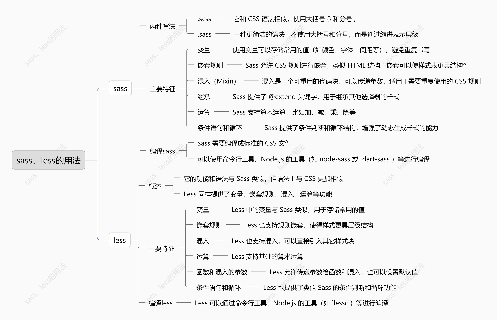

Sass 和 Less 都是 CSS 预处理器，它们通过增强 CSS 的功能，提高了样式表的可维护性和可扩展性。虽然它们的目的相同，但语法和功能上有一些差异。

### 1. **Sass**

Sass（Syntactically Awesome Style Sheets）是一个成熟的 CSS 预处理器，支持嵌套规则、变量、混入、继承等功能。Sass 有两种语法形式：

- **.scss（Sassy CSS）**：它和 CSS 语法相似，使用大括号 `{}` 和分号 `;`。
- **.sass**：一种更简洁的语法，不使用大括号和分号，而是通过缩进表示层级。

#### 主要特性

1. **变量**
    使用变量可以存储常用的值（如颜色、字体、间距等），避免重复书写。

   ```scss
   $primary-color: #333;
   $font-stack: Helvetica, sans-serif;
   
   body {
     color: $primary-color;
     font-family: $font-stack;
   }
   ```

2. **嵌套规则**
    Sass 允许 CSS 规则进行嵌套，类似 HTML 结构。嵌套可以使样式表更具结构性。

   ```scss
   .nav {
     ul {
       list-style-type: none;
     }
     li {
       display: inline-block;
     }
     a {
       color: $primary-color;
     }
   }
   ```

3. **混入（Mixin）**
    混入是一个可重用的代码块，可以传递参数，适用于需要重复使用的 CSS 规则。

   ```scss
   @mixin border-radius($radius) {
     -webkit-border-radius: $radius;
     -moz-border-radius: $radius;
     border-radius: $radius;
   }
   
   .box {
     @include border-radius(10px);
   }
   ```

4. **继承（Inheritance）**
    Sass 提供了 `@extend` 关键字，用于继承其他选择器的样式。

   ```scss
   .error {
     color: red;
   }
   
   .fatal-error {
     @extend .error;
     font-weight: bold;
   }
   ```

5. **运算**
    Sass 支持算术运算，比如加、减、乘、除等。

   ```scss
   $width: 100px;
   $height: 200px;
   
   .container {
     width: $width + 20px;
     height: $height / 2;
   }
   ```

6. **条件语句和循环**
    Sass 提供了条件判断和循环结构，增强了动态生成样式的能力。

   ```scss
   @if $primary-color == #333 {
     color: black;
   }
   
   @for $i from 1 to 5 {
     .item-#{$i} {
       width: 100px * $i;
     }
   }
   ```

#### 编译 Sass

Sass 需要编译成标准的 CSS 文件。可以使用命令行工具、Node.js 的工具（如 `node-sass` 或 `dart-sass`）等进行编译。

```bash
sass input.scss output.css
```

### 2. **Less**

Less 是另一个流行的 CSS 预处理器，它的功能和语法与 Sass 类似，但语法上与 CSS 更加相似。Less 同样提供了变量、嵌套规则、混入、运算等功能。

#### 主要特性

1. **变量**
    Less 中的变量与 Sass 类似，用于存储常用的值。

   ```less
   @primary-color: #333;
   @font-stack: Helvetica, sans-serif;
   
   body {
     color: @primary-color;
     font-family: @font-stack;
   }
   ```

2. **嵌套规则**
    Less 也支持规则嵌套，使得样式更具层级结构。

   ```less
   .nav {
     ul {
       list-style-type: none;
     }
     li {
       display: inline-block;
     }
     a {
       color: @primary-color;
     }
   }
   ```

3. **混入（Mixin）**
    Less 也支持混入，可以直接引入其它样式块。

   ```less
   .border-radius(@radius) {
     -webkit-border-radius: @radius;
     -moz-border-radius: @radius;
     border-radius: @radius;
   }
   
   .box {
     .border-radius(10px);
   }
   ```

4. **运算**
    Less 支持基础的算术运算。

   ```less
   @width: 100px;
   @height: 200px;
   
   .container {
     width: @width + 20px;
     height: @height / 2;
   }
   ```

5. **函数和混入的参数**
    Less 允许传递参数给函数和混入，也可以设置默认值。

   ```less
   .border-radius(@radius: 10px) {
     border-radius: @radius;
   }
   
   .box {
     .border-radius(15px);
   }
   ```

6. **条件语句和循环**
    Less 也提供了类似 Sass 的条件判断和循环功能。

   ```less
   @primary-color: #333;
   
   .box {
     .if (@primary-color == #333) {
       color: red;
     }
   }
   
   .items {
     .each(@i, 1, 5) {
       .item-@{i} {
         width: @i * 100px;
       }
     }
   }
   ```

#### 编译 Less

Less 可以通过命令行工具、Node.js 的工具（如 `lessc`）等进行编译。

```bash
lessc input.less output.css
```

### 3. **Sass vs Less**

| 特性           | Sass                                    | Less                          |
| -------------- | --------------------------------------- | ----------------------------- |
| 语法           | `.scss`（CSS 风格）或 `.sass`（缩进）   | `.less`（CSS 风格）           |
| 变量           | `$variable`                             | `@variable`                   |
| 混入           | `@mixin` 和 `@include`                  | `.mixin()` 和 `.mixin`        |
| 运算           | 支持加、减、乘、除                      | 支持加、减、乘、除            |
| 继承           | `@extend`                               | 无                            |
| 条件语句和循环 | `@if` 和 `@for`                         | `@if` 和 `@each`              |
| 兼容性         | 支持多种 CSS 特性，如嵌套选择器、参数化 | 语法和 CSS 更加接近，功能类似 |
| 社区支持       | 较大且成熟，支持更多工具和插件          | 更简洁、易用，学习曲线较平缓  |

### 总结

- **Sass** 提供了更多的高级功能（如条件语句、继承、参数化等），适用于需要复杂功能的项目。
- **Less** 更加简单直观，适合初学者和较为简单的项目需求。

两者都能有效提升 CSS 的可维护性和可扩展性，选择哪个主要取决于个人偏好和项目需求。

