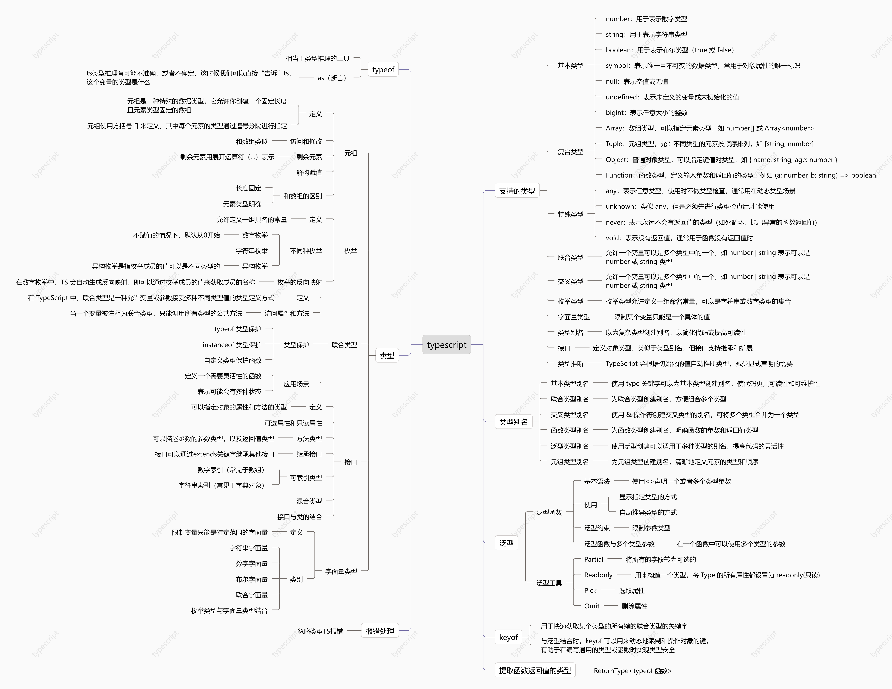

思维导图：



# ts支持什么类型？

TypeScript 是 JavaScript 的一个超集，它增加了静态类型检查功能，支持的类型包括：

1. **基本类型 (Primitive Types)**：

   - `number`：用于表示数字类型。
   - `string`：用于表示字符串类型。
   - `boolean`：用于表示布尔类型（`true` 或 `false`）。
   - `symbol`：表示唯一且不可变的数据类型，常用于对象属性的唯一标识。
   - `null`：表示空值或无值。
   - `undefined`：表示未定义的变量或未初始化的值。
   - `bigint`：表示任意大小的整数。

2. **复合类型 (Composite Types)**：

   - **Array**：数组类型，可以指定元素类型，如 `number[]` 或 `Array<number>`。
   - **Tuple**：元组类型，允许不同类型的元素按顺序排列，如 `[string, number]`。
   - **Object**：普通对象类型，可以指定键值对类型，如 `{ name: string, age: number }`。
   - **Function**：函数类型，定义输入参数和返回值的类型，例如 `(a: number, b: string) => boolean`。

3. **特殊类型**：

   - `any`：表示任意类型，使用时不做类型检查，通常用在动态类型场景。
   - `unknown`：类似 `any`，但是必须先进行类型检查后才能使用。
   - `never`：表示永远不会有返回值的类型（如死循环、抛出异常的函数返回值）。
   - `void`：表示没有返回值，通常用于函数没有返回值时。

4. **联合类型 (Union Types)**：

   - 允许一个变量可以是多个类型中的一个，如 `number | string` 表示可以是 `number` 或 `string` 类型。

5. **交叉类型 (Intersection Types)**：

   - 允许将多个类型合并成一个类型，表示一个值同时拥有多个类型的属性，如 `{ name: string } & { age: number }`。

6. **枚举 (Enum)**：

   - 枚举类型允许定义一组命名常量，可以是字符串或数字类型的集合，例如：

     ```typescript
     enum Color {
       Red = "RED",
       Green = "GREEN",
       Blue = "BLUE"
     }
     ```

7. **字面量类型 (Literal Types)**：

   - 限制某个变量只能是一个具体的值，如 `'red'`、`'green'`，或者数字字面量，如 `1`、`2`。

8. **类型别名 (Type Aliases)**：

   - 可以为复杂类型创建别名，以简化代码或提高可读性，例如：

     ```typescript
     type Point = { x: number, y: number };
     ```

9. **接口 (Interface)**：

   - 定义对象类型，类似于类型别名，但接口支持继承和扩展。例如：

     ```typescript
     interface Person {
       name: string;
       age: number;
     }
     ```

10. **类型推断 (Type Inference)**：

- TypeScript 会根据初始化的值自动推断类型，减少显式声明的需要。

# 类型别名

使用情景：当同一个类型被多次使用，可以通过类型别名简化该类型的使用

## 基本类型别名

使用 `type` 关键字可以为基本类型创建别名，使代码更具可读性和可维护性。

```typescript
type MyString = string;
type MyNumber = number;
type MyBoolean = boolean;
```

你可以像使用原始类型一样使用这些别名：

```typescript
let str: MyString = "Hello";
let num: MyNumber = 42;
let bool: MyBoolean = true;
```

## 联合类型别名

为联合类型创建别名，方便组合多个类型。

```typescript
type StringOrNumber = string | number;
```

使用该别名：

```typescript
let value: StringOrNumber = "Hello";
value = 123;
```

## 交叉类型别名

使用 `&` 操作符创建交叉类型的别名，可将多个类型合并为一个类型。

```typescript
type Person = { name: string; } & { age: number; };
```

使用交叉类型别名：

```typescript
let person: Person = { name: "Alice", age: 30 };
```

## 函数类型别名

为函数类型创建别名，明确函数的参数和返回值类型。

```typescript
type MathFunction = (x: number, y: number) => number;
```

使用函数类型别名：

```typescript
let add: MathFunction = (x, y) => x + y;
let result = add(5, 3);
```

## 泛型类型别名

使用泛型创建可以适用于多种类型的别名，提高代码的灵活性。

```typescript
type ArrayOf<T> = Array<T>;
```

使用泛型类型别名：

```typescript
let numbers: ArrayOf<number> = [1, 2, 3];
let strings: ArrayOf<string> = ["a", "b", "c"];
```

## 元组类型别名

为元组类型创建别名，清晰地定义元素的类型和顺序。

```typescript
type NameAndAge = [string, number];
```

使用元组类型别名：

```typescript
let personTuple: NameAndAge = ["Bob", 25];
```

# typeof

作用：提取出值、或者变量的类型

## 注意点

第一，typeof 可以写在注解里，typeof后面要跟着值，或者变量

```
const obj = {
    name:'carl',
    age:12
}
const obj2: typeof obj = {
    name:'doudou',
    age:45
}
```

第二，typeof不能取出函数调用的返回值的类型，即typeof fn()，这样写是错误的，

取出函数调用的返回值的类型只能通过泛型

```
const fn = (a:number,b:number)=>{
    return a+b
}
// 这种写法是错误的
const result = typeof fn(1,2)=3
```

## 断言（as）

使用场景：ts推断不准确，我们更了解需要的类型是什么，让ts听我们的。

```
const onInput = document.getElementById('username') as HTMLInputElement
console.log(onInput.type)
```

# 对象类型

作用：描述对象的结构，包含什么键名、键值，以及键值的类型

对象的键值上存在函数的写法：

> 写法一

```typescript
/* 语法 */
// 创建类型别名
type Person = {
    sayHi:(形参类型)=>返回值类型
}
/* demo */
type ObjType = {
    sayHi:(str:string)=>void
}
let obj:ObjType = {
    sayHi:(str)=>{
        console.log(str)
    }
}
obj.sayHi('你好')
```

> 写法二

```typescript
/* 语法 */
// 创建类型别名
type Person = {
    sayHello(形参类型):返回值类型
}
/* demo */
type ObjType = {
    sayHello(str:string):void
}
let obj:ObjType = {
    sayHello:(str)=>{
        console.log(str)
    }
}
obj.sayHello('你好')
```

# 元组

## 定义和基本用法

在TS中，元组是一种特殊的数据类型，它允许创建一个固定长度且元素类型固定的数组。例如：

```typescript
let tuple:[string,number] = ["hello",10]
```

## 元素的访问和修改

可以通过索引来访问和修改元组中的元素，索引从 `0` 开始。

```typescript
let tuple: [string, number] = ["hello", 10];
console.log(tuple[0]); // 输出 "hello"
tuple[1] = 20; // 合法，因为 20 也是数字类型
```

## 剩余元素

从 TypeScript 4.0 开始，元组类型支持剩余元素，允许表示具有可变数量的特定类型元素的元组。例如：

```typescript
let tuple: [string,...number[]] = ["hello", 1, 2, 3];
```

## 解构赋值

元组可以进行解构赋值，将元组中的元素分别赋值给不同的变量。例如：

```typescript
let tuple: [string, number] = ["hello", 10];
let [str, num] = tuple;
console.log(str); // 输出 "hello"
console.log(num); // 输出 10
```

## 和数组的区别

1. **长度固定性**：数组的长度可以动态变化，而元组的长度在定义时是固定的，不能随意增加或减少元素。
2. **元素类型明确性**：数组中的元素可以是任意类型，而元组中的每个元素都有明确指定的类型，并且类型顺序是固定的。

# 枚举

在 TypeScript（TS）中，枚举是一种特殊的数据类型，它允许定义一组具名的常量。

**定义**

使用`enum`关键字来定义枚举类型。例如：

```typescript
enum Direction {
    Up,
    Down,
    Left,
    Right
}
```

在这个例子中，`Direction`是一个枚举类型，它有四个成员：`Up`、`Down`、`Left`和`Right`。默认情况下，这些成员的值会从 0 开始自动递增，所以`Direction.Up`的值为 0，`Direction.Down`的值为 1，以此类推。

**枚举成员的值**

可以手动为枚举成员赋值。例如：

```typescript
enum Status {
    Success = 200,
    NotFound = 404,
    ServerError = 500
}
```

在这个例子中，`Status.Success`的值为 200，`Status.NotFound`的值为 404，`Status.ServerError`的值为 500。

**枚举的使用**

枚举可以作为一种更清晰、更可读的方式来表示一组相关的常量。例如，可以使用枚举来表示方向、状态码、颜色等。以下是一个使用枚举的示例：

```typescript
function move(direction: Direction) {
    switch (direction) {
        case Direction.Up:
            console.log('向上移动');
            break;
        case Direction.Down:
            console.log('向下移动');
            break;
        case Direction.Left:
            console.log('向左移动');
            break;
        case Direction.Right:
            console.log('向右移动');
            break;
        default:
            console.log('无效的方向');
    }
}

move(Direction.Up); 
```

**字符串枚举**

除了数字枚举，TS 还支持字符串枚举。在字符串枚举中，每个成员都必须手动赋值为字符串字面量或其他字符串枚举成员。例如：

```typescript
enum Message {
    Success = '操作成功',
    Failure = '操作失败'
}
```

**异构枚举**

异构枚举是指枚举成员的值可以是不同类型的。虽然不常见，但在某些特定场景下可能会有用。例如：

```typescript
enum MixedEnum {
    First = 1,
    Second = 'two'
}
```

**枚举的反向映射**

在数字枚举中，TS 会自动生成反向映射，即可以通过枚举成员的值来获取成员的名称。例如：

```typescript
enum Color {
    Red = 1,
    Green = 2,
    Blue = 3
}

let colorName = Color[2]; 
console.log(colorName); 
```

在这个例子中，`Color[2]`会返回`Green`，因为`Green`的值为 2。

# 数组

## 常规写法

```
// 语法
number[]
let arr1:number[] = [1,2,6]
```

## 泛型写法

```
// 语法
Array<number>
let arr2:Array<number> = [1,6,8]
```

# 函数

## 第一种写法

> 单独指定函数参数、返回值的类型

```
// 语法格式
(参数1：类型,参数2:类型)：类型
// 例子
const add = (num1:number,num2:number):number =>{
    return num1+num2
}
add(1,2)
```

## 第二种写法

> 同时指定函数参数、返回值的类型

```
// 语法格式
type 类型名字 = (参数1:类型，参数2:类型)=>类型
const 函数名字:类型名字 = (参数1，参数2)=>{return xxx}

// 例子
type Mytype = (num1:number,num2:number)=>number
const add:Mytype = (num1,num2)=>{
    return num1+num2
}
add(1,2)
```

## 函数的可选参数

语法形式：在形参后面加问号（？），类似于ES6的可选链的写法

使用场景：函数的参数可以不传，可以使用可选参数

示例：

```
function add（a?:number,b?:number）{
    return a+b
}
```

注意：可选参数必须放在必选参数的后面，可选参数后面不能存在必选参数。

## 说明

1. 同时指定类型的写法，函数只能是箭头函数的形式
2. js中的函数没有返回值，返回值为undefined
3. ts中的函数如果没有指定返回值，返回值为void，表示空
4. 在ts中没有返回值时，也可以return undefined，但是不推荐这种写法

# 联合类型

## 定义和语法

在 TypeScript 中，联合类型是一种允许变量或参数接受多种不同类型值的类型定义方式。例如，`string | number`表示一个变量可以是字符串类型或者数字类型。

示例：

```typescript
let myVar: string | number;
myVar = "Hello";
console.log(myVar); 
myVar = 10;
console.log(myVar); 
```

## 访问属性和方法

当一个变量被定义为联合类型时，只能访问所有联合类型中共同拥有的属性和方法。例如，对于`string | number`类型的变量，不能直接调用`string`类型特有的`substring`方法或`number`类型特有的`toFixed`方法，因为另一种类型可能不具备该方法。

## 类型保护

在使用联合类型时，常常需要进行类型保护来确保在特定的代码块中，变量是我们期望的类型。TypeScript 提供了几种类型保护的方式：

- typeof 类型保护：通过`typeof`操作符来检查变量的类型。例如：

```typescript
function printValue(value: string | number) {
    if (typeof value === "string") {
        console.log(value.toUpperCase());
    } else {
        console.log(value.toFixed(2));
    }
}
```

- instanceof 类型保护：用于检查对象是否是某个类的实例。例如：

```typescript
class Dog {
    bark() {
        console.log("汪汪汪");
    }
}

class Cat {
    meow() {
        console.log("喵喵喵");
    }
}

function animalSound(animal: Dog | Cat) {
    if (animal instanceof Dog) {
        animal.bark();
    } else {
        animal.meow();
    }
}
```

- **自定义类型保护函数**：可以定义自己的类型保护函数，通过返回一个类型谓词来判断变量的类型。例如：

```typescript
function isString(value: any): value is string {
    return typeof value === "string";
}

function processValue(value: string | number) {
    if (isString(value)) {
        console.log(value.length);
    } else {
        console.log(value + 10);
    }
}
```

## 联合类型的应用场景

- **函数参数的灵活性**：允许函数接受多种类型的参数，提高函数的通用性。例如，一个函数可以接受字符串或数字作为参数进行不同的处理。
- **表示可能的多种状态或值**：在某些情况下，一个变量可能有多种可能的取值类型，联合类型可以清晰地表达这种情况。比如，一个接口可能返回成功的结果（数据类型）或者失败的原因（字符串类型）。

# 接口

在 TypeScript 中，接口（`interface`）是一种用来定义对象结构的方式，它可以指定对象的属性和方法的类型。接口帮助我们在编程时更加明确地约定对象的形态，并且可以利用接口来做类型检查。接口不仅可以用于描述对象类型，还可以用于描述函数类型、数组类型等。

## 定义基本的对象接口

```typescript
interface Person {
  name: string;
  age: number;
}

const person: Person = {
  name: "Alice",
  age: 25
};

```

在上面的例子中，`Person` 接口规定了对象必须具有 `name` 和 `age` 属性，并且它们分别是 `string` 类型和 `number` 类型。

## 可选属性

在接口中，某些属性可以是可选的，这意味着对象不一定需要提供这些属性。可选属性通过在属性名后加上问号 `?` 来定义：

```typescript
interface Person {
  name: string;
  age?: number;  // 可选属性
}

const person1: Person = { name: "Alice" };  // 合法
const person2: Person = { name: "Bob", age: 30 };  // 合法

```

## 只读属性

可以通过 `readonly` 修饰符来定义只读属性，这样属性值只能在对象创建时被设置，之后无法修改：

```typescript
interface Person {
  readonly name: string;
  age: number;
}

const person: Person = { name: "Alice", age: 25 };
person.name = "Bob";  // 错误：name 是只读属性

```

## 方法类型

接口还可以用来描述函数类型。你可以在接口中定义函数的参数类型和返回值类型：

```typescript
interface Greet {
  (name: string): string;
}

const greet: Greet = (name) => {
  return `Hello, ${name}`;
};

```

## 继承接口

接口可以通过 `extends` 关键字继承其他接口，允许一个接口继承多个其他接口的结构：

```typescript
interface Animal {
  name: string;
  makeSound(): void;
}

interface Dog extends Animal {
  breed: string;
}

const dog: Dog = {
  name: "Buddy",
  breed: "Golden Retriever",
  makeSound: () => console.log("Woof!")
};

```

## 可索引类型

接口也可以描述可索引类型的对象，即你可以定义一个对象的键的类型和对应值的类型：

> 数字索引（常见于数组）

```typescript
interface StringArray {
  [index: number]: string;
}

let arr: StringArray = ["hello", "world"];
console.log(arr[0]);  // 输出 "hello"

```

> 字符串索引（常见于字典对象）

```typescript
interface PhoneBook {
  [name: string]: number;  // 索引是字符串类型，值是数字类型
}

const phoneBook: PhoneBook = {
  "Alice": 1234567890,
  "Bob": 9876543210,
};

console.log(phoneBook["Alice"]);  // 输出 1234567890
console.log(phoneBook["Bob"]);    // 输出 9876543210

```

## 混合类型

接口可以描述对象，甚至支持同时拥有多个不同的结构：

```typescript
interface Counter {
  (start: number): string;  // 可调用的函数
  count: number;  // 普通属性
}

const counter: Counter = ((start: number) => {
  return `Counting from ${start}`;
}) as Counter;

counter.count = 0;
console.log(counter(5));  // 输出 "Counting from 5"
console.log(counter.count);  // 输出 0

```

## 接口与类的结合

类也可以实现接口，确保类中包含接口中定义的所有属性和方法：

```typescript
interface Shape {
  area(): number;
}

class Circle implements Shape {
  radius: number;

  constructor(radius: number) {
    this.radius = radius;
  }

  area(): number {
    return Math.PI * this.radius * this.radius;
  }
}

const circle = new Circle(5);
console.log(circle.area());  // 输出圆的面积

```

# 字面量类型

## 定义

在 TypeScript 中，字面量类型（Literal Types）是指将具体的值作为类型来使用，限制变量的值只能是该特定的字面量。

## 分类

### 字符串字面量类型

你可以指定一个变量的值只能是某个特定的字符串。

```typescript
let direction: "up" | "down"; // 只能是 "up" 或 "down"
direction = "up";  // 正确
direction = "left";  // 错误: 类型 "left" 不可赋值给类型 '"up" | "down"'

```

### 数字字面量类型

你也可以指定数字字面量类型，限制一个变量只能是某个特定的数字。

```typescript
let statusCode: 200 | 404 | 500;  // 只能是 200, 404 或 500
statusCode = 200;  // 正确
statusCode = 404;  // 正确
statusCode = 300;  // 错误: 类型 "300" 不可赋值给类型 "200 | 404 | 500"

```

### 布尔字面量类型

与数字和字符串类似，你可以指定布尔值的字面量类型。

```typescript
let isActive: true | false;  // 只能是 true 或 false
isActive = true;  // 正确
isActive = false;  // 正确
isActive = 1;  // 错误: 类型 "1" 不可赋值给类型 "true | false"

```

### 联合字面量类型

字面量类型也可以通过联合类型进行组合，即变量可以是多个不同的字面量中的一个。

```typescript
let response: "yes" | "no" | "maybe"; // 可以是 "yes", "no", 或 "maybe"
response = "yes";  // 正确
response = "no";   // 正确
response = "maybe";  // 正确
response = "maybe not";  // 错误: 类型 "maybe not" 不可赋值给类型 '"yes" | "no" | "maybe"'

```

### 枚举类型与字面量类型结合

字面量类型也常用于枚举类型，枚举成员的值实际上是字面量类型。

```typescript
enum Direction {
  Up = "up",
  Down = "down",
  Left = "left",
  Right = "right"
}

let direction: Direction = Direction.Up;  // 正确
direction = "up";  // 错误: 类型 '"up"' 不可赋值给类型 'Direction'

```

# any、unknown、never

- any，表示任意类型，能兼容所有类型，也能够被所有类型兼容，使用 any 时类型推导与检查不会生效；
- unknown，表示类型未知、但未来会确定类型；
- never，代表无类型，不带类型信息，常见的是 throw error 函数

```typescript
function throwError():never{
    throw new Error()
}
```

# keyof

`keyof` 是 TypeScript 中的一个关键字，用于获取某个类型的所有键（属性名）组成的联合类型。它与泛型有一定的关系，尤其是在结合泛型时，`keyof` 允许你更加灵活和动态地操作类型。

## 基本用法

`keyof` 用来获取一个对象类型的所有键，返回的是一个字符串字面量类型的联合。以下是一个简单的例子：

```typescript
interface Person {
  name: string;
  age: number;
}

// keyof 获取 Person 对象类型的所有键
type PersonKeys = keyof Person;  // 'name' | 'age'

```

在这个例子中，`keyof Person` 返回了 `'name' | 'age'`，即 `Person` 类型的所有属性名。

`keyof` 与泛型结合时，可以让你在编写更通用的函数、类型或接口时限制和操作特定的键。例如，可以用它来做某些字段的访问或动态更新，确保只有合法的键可以被使用。

## 与泛型的关系

**示例 1：泛型函数中的keyof**

假设我们有一个对象，并希望通过泛型函数来访问该对象的某个属性：

```typescript
function getValue<T, K extends keyof T>(obj: T, key: K): T[K] {
  return obj[key];
}

const person = { name: "Alice", age: 30 };

const name = getValue(person, "name");  // Alice
const age = getValue(person, "age");    // 30

```

在这个例子中：

- `T` 是泛型，表示任何对象类型。
- `K` 是泛型参数，它被限定为 `T` 的键之一，使用了 `keyof T` 来确保只有 `T` 对象的有效键（属性名）可以作为 `key`。
- `T[K]` 表示 `key` 对应的值类型，这样我们确保返回的是 `key` 对应的值。

**示例 2：泛型类型中的 `keyof`**

`keyof` 也可以在泛型类型约束中使用。例如，定义一个只接受对象的键的类型：

```typescript
type GetValueOfKey<T, K extends keyof T> = T[K];

const person = { name: "Bob", age: 25 };

// Get the type of the value of the 'name' property (string)
type NameType = GetValueOfKey<typeof person, "name">;  // string

```

在这个例子中：

- `T` 是泛型类型，它代表了对象类型。
- `K extends keyof T` 限制了 `K` 只能是 `T` 的有效键。
- `T[K]` 返回了 `K` 对应的值类型。

# 泛型

## 泛型函数

在 TypeScript 中，泛型函数允许你定义可以处理多种类型的函数，而不需要在编写函数时明确指定这些类型。泛型使得函数在不同的类型之间保持灵活性，同时仍然能够提供类型安全。

### **基本语法**

一个泛型函数的定义方式通常是使用 `<>` 来声明一个或多个类型参数。这些类型参数可以在函数体内使用。

```typescript
function identity<T>(arg: T): T {
  return arg;
}

```

- `T` 是一个类型参数，它表示函数可以接受任何类型的参数。
- `arg: T` 表示函数接受一个类型为 `T` 的参数。
- `: T` 表示函数返回值的类型是 `T`，即与参数类型相同。

### **泛型函数的使用**

你可以在调用泛型函数时显式地指定类型，也可以让 TypeScript 根据传入的参数推导出类型。

1. **显示指定类型**

```typescript
let result = identity<number>(42);
console.log(result); // 42

```

2. **自动推导类型**

```typescript
let result = identity("hello");
console.log(result); // "hello"

```

在这个例子中，TypeScript 会自动推导出 `T` 为 `string`，因为传入的参数是一个字符串。

### 泛型约束

你可以对泛型参数进行约束，确保它们满足某些条件。比如，限制泛型必须是某个接口或类的子类型。

```typescript
function loggingIdentity<T extends { length: number }>(arg: T): T {
  console.log(arg.length);
  return arg;
}

loggingIdentity([1, 2, 3]); // 数组有 length 属性
loggingIdentity("Hello");   // 字符串有 length 属性
// loggingIdentity(42);     // 错误，数字没有 length 属性

```

在这个例子中，`T extends { length: number }` 表示 `T` 必须具有 `length` 属性。

### 泛型函数与多个类型参数

也可以在一个函数中使用多个类型参数：

```typescript
function pair<T, U>(first: T, second: U): [T, U] {
  return [first, second];
}

let p = pair(1, "apple");
console.log(p); // [1, "apple"]

```

## 泛型工具

### Partial

作用：将所有的字段转为可选的

```typescript
type ObjType = {
    name: string;
    age: number;
}
const obj:Partial<ObjType> = {
    name:'carl',
    age: 18
}
```

### Readonly

作用：用来构造一个类型，将 Type 的所有属性都设置为 readonly(只读)

```typescript
type ObjType = {
    name: string;
    age: number;
}
type NewObjType = Readonly<ObjType>
const obj:NewObjType = {
    name:'carl',
    age: 18
}
// 不可以改变属性值，这个操作是错误的
obj.name = 19
```

### Pick

作用：选取属性

语法：Pick<对象结构，键名组成的联合类型>

```typescript
interface ObjectType{
    name: string;
    age: number;
    gender: boolean;
}
const obj:Pick<ObjectType,"age"|"gender"> = {
    age: 18,
    gender: true
}
```

### Omit

作用：删除属性

语法：Omit<对象结构，删除的键名组成的联合类型>

```typescript
type ObjectType = {
    name: string;
    age: number;
    gender: boolean;
}
const obj:Omit<ObjectType,"age"|"gender"> = {
    name:'carl'
}
```

# 提取函数返回值的类型

语法：ReturnType<typeof 函数>。

```typescript
const fn = (a:number,b:number)=>{
    return a+b
}
// 提取函数返回值的类型
type FnType = ReturnType<typeof fn>
const result = (x:FnType,y:FnType):FnType=>{
    return x+y
}
```

# 忽略类型TS报错

在src目录下面创建一个 typings.d.ts：

> typings.d.ts

```typescript
// global.d.ts 或 typings.d.ts
declare var OSS: any; // 或者更具体的类型定义
```