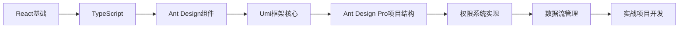

# 技术选型

## 技术架构

| 模块         | 技术选型                                              |
| ------------ | ----------------------------------------------------- |
| **前端**     | Ant Design Pro v5 + Umi 4 + TypeScript                |
| **后端**     | NestJS 9 + TypeScript + TypeORM                       |
| **数据库**   | PostgreSQL (主库) + Redis (缓存/会话)                 |
| **文件存储** | MinIO (自托管对象存储) + 阿里云OSS/码云API (长期存储) |
| **部署**     | Docker + Kubernetes (后端) / Vercel (前端)            |
| **监控**     | Sentry (前端错误监控) + Prometheus/Grafana (后端监控) |

## Ant Design Pro 优势分析
1. **开箱即用的功能**：
   - 内置用户管理/权限控制模板
   - 预置ProComponents高级组件(表格/表单/图表)
   - 内置国际化方案
   - 完善的权限路由系统

2. **最佳实践集成**：
   
   ```mermaid
   graph LR
   A[Ant Design Pro] --> B[Umi 路由]
   A --> C[Dva 状态管理]
   A --> D[Ant Design 组件库]
   A --> E[Mock 数据]
   A --> F[构建部署]
   ```
   
3. **与需求完美匹配**：
   - 内置权限管理方案(`access.ts`)
   - 预制多种图表组件(对接ECharts)
   - 表格导出功能(Excel/PDF)
   - 多语言支持

## 关键模块实现方案

### 1. 用户系统与权限控制
**前端实现**：

```typescript
// src/access.ts
export default function access(initialState: { currentUser?: API.CurrentUser } {
  const { currentUser } = initialState || {};
  return {
    canAdmin: currentUser && currentUser.role === 'admin',
    canUpload: currentUser && currentUser.permissions.includes('file:upload'),
    // 更多权限点...
  };
}

// 在组件中使用
const access = useAccess();
{access.canUpload && <UploadButton />}
```

**后端RBAC设计**：

```typescript
// 角色-权限关联
@Entity()
export class Role {
  @PrimaryGeneratedColumn()
  id: number;

  @Column({ unique: true })
  name: string; // admin/editor/viewer

  @Column('simple-array')
  permissions: string[]; // ['file:read', 'file:write']
}

// 用户-角色关联
@Entity()
export class User {
  // ...
  @ManyToMany(() => Role)
  @JoinTable()
  roles: Role[];
}
```

### 2. 文件管理系统
**前端上传组件**：
```jsx
// src/pages/FileManager/components/UploadPanel.tsx
import { ProFormUploadButton } from '@ant-design/pro-components';

export default () => (
  <ProFormUploadButton
    name="file"
    label="文件上传"
    max={5}
    fieldProps={{
      name: 'file',
      beforeUpload: (file) => {
        // 文件类型验证
        const isValid = ['image/png', 'application/pdf'].includes(file.type);
        if (!isValid) message.error('不支持的文件类型');
        return isValid;
      }
    }}
    action="/api/v1/files/upload"
  />
);
```

**后端存储策略**：
```typescript
// 策略模式实现
interface StorageStrategy {
  upload(file: Express.Multer.File): Promise<string>;
}

@Injectable()
export class FileService {
  constructor(
    @Inject('TEMPORARY_STORAGE') private tempStorage: StorageStrategy,
    @Inject('LONGTERM_STORAGE') private longtermStorage: StorageStrategy
  ) {}

  async uploadFile(file: Express.Multer.File, isTemporary: boolean) {
    const strategy = isTemporary ? this.tempStorage : this.longtermStorage;
    return strategy.upload(file);
  }
}
```

### 3. 报表与仪表盘
**Ant Design Pro 图表集成**：
```jsx
// src/pages/Dashboard/Analysis.tsx
import { Column } from '@ant-design/charts';

export default () => {
  const [data, setData] = useState([]);

  useEffect(() => {
    fetchData().then(setData);
  }, []);

  const config = {
    data,
    xField: 'date',
    yField: 'value',
    seriesField: 'category',
    isGroup: true,
  };

  return (
    <ProCard>
      <Column {...config} />
      <ExportButtons onExport={handleExport} />
    </ProCard>
  );
};
```

## 项目结构

```bash
# 前端项目结构
tianshu-fe/
├── config/            # Umi配置
├── mock/              # 前端Mock数据
├── src/
│   ├── pages/         # 页面组件
│   ├── services/      # API服务
│   └── app.tsx        # 运行时配置
└── package.json

# 后端项目结构
tianshu-be/
├── src/
│   ├── modules/       # 业务模块
│   ├── shared/        # 共享库
│   └── main.ts        # 入口文件
├── test/              # 测试代码
└── package.json
```

## 开发与部署流程

1. **本地开发**：
   ```bash
   # 前端
   cd fe && npm install
   npm run start:dev
   
   # 后端
   cd be && npm install
   docker-compose up -d  # 启动DB/Redis/MinIO
   npm run start:dev
   ```

2. **生产部署**：
   ```mermaid
   graph LR
   A[GitHub仓库] --> B[CI/CD流水线]
   B --> C{环境判断}
   C -->|生产| D[构建前端静态文件]
   C -->|生产| E[构建Docker镜像]
   D --> F[上传至CDN]
   E --> G[部署到K8s集群]
   ```

## 特别注意事项

1. **Ant Design Pro 定制**：
   - 修改 `src/app.tsx` 配置请求拦截器
   - 在 `src/global.less` 覆盖主题变量
   - 使用 `@ant-design/pro-layout` 定制菜单

2. **权限同步方案**：
   ```mermaid
   sequenceDiagram
     前端->>后端: 登录请求
     后端->>前端: 返回JWT + 权限列表
     前端->>前端: 设置access.ts权限
     前端->>后端: 带Token的API请求
     后端->>后端: 验证权限
   ```

3. **文件存储迁移策略**：
   - 阶段1：全部使用MinIO
   - 阶段2：添加存储策略开关
   - 阶段3：实现自动归档(7天未操作文件→转码云)

# 在使用ant design pro之前，需要学习什么？

## 核心前置知识体系

| 知识领域       | 具体内容                                                 | 重要性 | 学习资源                                                     | 掌握程度 |
| -------------- | -------------------------------------------------------- | ------ | ------------------------------------------------------------ | -------- |
| **React 基础** | 组件化开发、Hooks API、状态管理、Context API、JSX 语法   | ★★★★★  | [React 官方文档](https://react.dev/learn)                    | ★★☆☆☆    |
| **TypeScript** | 类型系统、接口、泛型、装饰器、TS 与 React 集成           | ★★★★★  | [TypeScript 入门教程](https://www.typescriptlang.org/docs/handbook/intro.html) | ☆☆☆☆☆    |
| **Ant Design** | 组件库使用、Form/Table 高级用法、主题定制、国际化        | ★★★★☆  | [Ant Design 文档](https://ant.design/components/overview-cn) | ☆☆☆☆☆    |
| **Umi 框架**   | 路由配置、插件机制、数据流管理、mock 服务、构建部署      | ★★★★☆  | [Umi 4 官方文档](https://umijs.org/docs/guides/getting-started) | ☆☆☆☆☆    |
| **前端工程化** | npm/yarn/pnpm、Webpack/Vite、ESLint/Prettier、Git 工作流 | ★★★☆☆  | [现代 JavaScript 教程](https://zh.javascript.info/)          | ★★★★★    |

## Ant Design Pro 特有概念学习重点

### 1. 项目结构与核心文件
```bash
ant-design-pro/
├── config # Umi 配置
├── mock   # 本地模拟数据
├── src
│   ├── assets       # 静态资源
│   ├── components   # 全局组件
│   ├── layouts      # 布局组件
│   ├── pages        # 业务页面
│   ├── services     # API 服务
│   ├── utils        # 工具库
│   ├── app.tsx      # 运行时配置
│   └── access.ts    # 权限控制 👈 重点文件
```

### 2. 必须掌握的四大核心机制

**2.1 路由与菜单系统**
- 路由配置 (`config/routes.ts`)
- 菜单自动生成原理
- 权限路由实现方式
```typescript
// 示例：带权限的路由配置
{
  path: '/dashboard',
  name: '仪表盘',
  icon: 'DashboardOutlined',
  access: 'canViewDashboard', // 权限标识
  component: './Dashboard',
}
```

**2.2 权限控制体系**
- `access.ts` 权限定义文件
- 页面级权限控制
- 组件级权限控制
```typescript
// src/access.ts
export default function access(initialState: { currentUser?: API.CurrentUser }) {
  const { currentUser } = initialState || {};
  return {
    canAdmin: currentUser?.role === 'admin',
    canUpload: currentUser?.permissions.includes('file:upload'),
  };
}

// 在组件中使用
const access = useAccess();
{access.canUpload && <UploadButton />}
```

**2.3 数据流管理**
- Umi 的 `useModel` 钩子
- Dva 状态管理（可选）
- 服务请求封装 (`services/`)
```typescript
// 使用 useModel 获取全局状态
import { useModel } from 'umi';

export default () => {
  const { initialState } = useModel('@@initialState');
  return <div>{initialState?.currentUser?.name}</div>;
};
```

**2.4 请求处理**
- `request` 拦截器配置 (`app.tsx`)
- 错误统一处理
- Mock 数据集成
```typescript
// src/app.tsx
export const request: RequestConfig = {
  timeout: 10000,
  errorConfig: {
    adaptor: (resData) => ({
      success: resData.code === 0,
      errorMessage: resData.message,
    }),
  },
  requestInterceptors: [
    (url, options) => {
      const token = localStorage.getItem('token');
      return {
        url,
        options: { 
          ...options, 
          headers: { ...options.headers, Authorization: `Bearer ${token}` }
        },
      };
    },
  ],
};
```

## 高效学习路径



> 建议花费 1-2 周时间系统学习后再正式开发"天枢系统"。初期可先实现一个简单的用户管理模块（包含 CRUD 和权限控制），这将涵盖 Ant Design Pro 80% 的核心功能。

